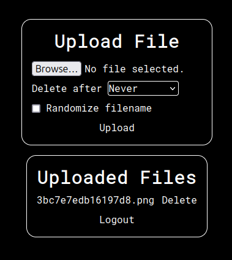

# SnapShare
A fast, lightweight and simple way to share files. 

### Features
- Password protected menu
- Web traffic logging
- Temporary uploads
- Randomized file names
- Uploaded files list
- Fairly fast

*The password protection isn't supposed to be the next fort knox. It's a simple code that's entered before the user is given access to the menu.

### Installation
**Prerequisites:**
- Node.js v16 and above installed + npm
- Fairly fast internet (for serving files)
- If on a VPS, preferably unlimited bandwidth

**Setup:**
```bash
git clone https://github.com/DvidPiDev/SnapShare # Clone the repo
cp .env_example .env # Copy the env example to an actual env file
# (Don't forget to fill out the env file, see below for info)
npm install # Install dependencies
npm start # Start!
```

**Configuration:** \
All options you could possibly need are in the .env file:
```env
PASSWORD= #The passphrase used to access the menu (default: password)
PORT= #Webserver port (default: 8700)
MAX_FILE_SIZE= #Max file size in MB (default: 1GB)
SESSION_KEY= #Read below (default is insecure)
```
The `SESSION_KEY` can be literally anything, ideally a sha256 hash of something random. By the way, you don't need to put strings in quotes unless they have spaces. (Which they shouldn't) 

Traffic logging is performed in the "traffic.log" file.

### Screenshots
Login interface \
 \
Main interface \
 \
The UI is very basic as it's all that I need.

### Backstory
One day, I had a big file that I really, really needed to share with someone on Discord, but I couldn't because the upload limit was in my way. I could've just used dropbox or similar but that was too complex.

I found linx-server - a very simple file uploader, but I just *wasn't feeling it*. So over the span of a few hours, I made this.
